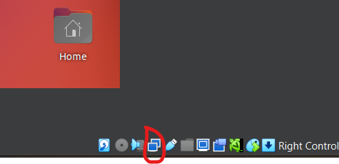
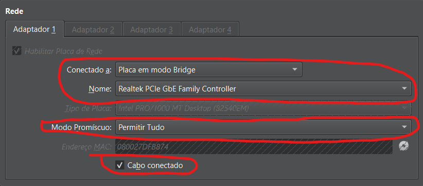
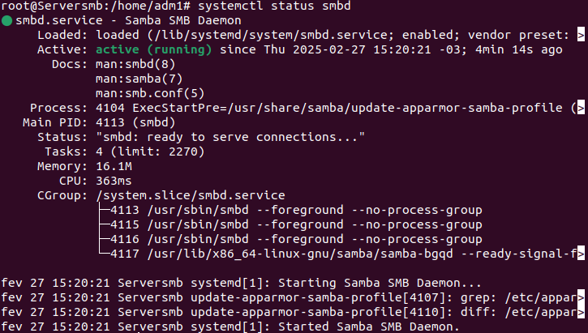
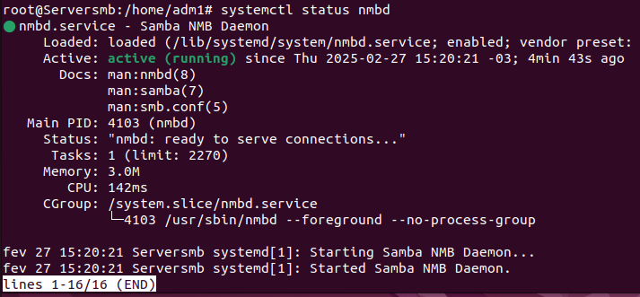
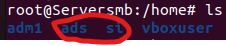
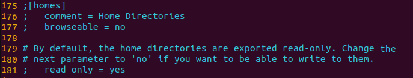
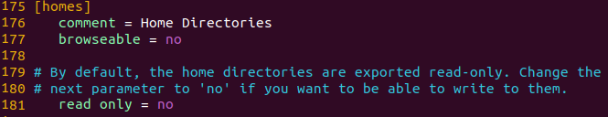
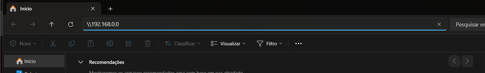
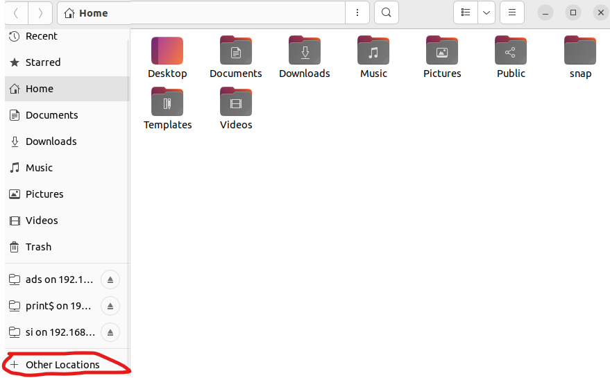
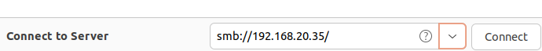

<h1 align="center">🕺 Samba Sebastian</h1>
<h2 align="center">Configurações para criar um servidor SAMBA</h2>

<p align="center">
<b>Este Repositório Está Sendo Utilizado Somente Para a Aplicação da Atividade Do Projeto Final da Cadeira de Segurança em Sistemas Operacionais e Redes de Computadores!</b>
</p>

<h2> 👨‍💻 Objetivos Da Atividade</h2>
O objetivo desta atividade é que você instale e configure o Samba para compartilhar arquivos de forma segura, fazendo um controle de acesso para que cada usuário possa acessar apenas os arquivos que pertencem a ele ou os que são públicos.

<h2> 🤓 Pré-Requisitos</h2>

Para a realização dessa atividade, será necessário alguns pré-requisitos:

- Ter o virtualizador de Sistemas Operacionais VirtualBox instalado
    - [VirtualBox](https://www.virtualbox.org/wiki/Downloads)
- O Sistema Operacaional Linux Ubuntu
    - [Ubuntu 22.04.5 LTS (Jammy Jellyfish)](https://releases.ubuntu.com/jammy/ubuntu-22.04.5-desktop-amd64.iso)
- 2 Notebooks (Windows 11 e Windows 10)
- 1 Máquina Virtual (Ubuntu 22.04.5 )
- 3 computadores (Windows 11)

 
<h2>  🦵 Passo a passo</h2>
Para iniciar, é necessário estar logado em um perfil de administrador em uma máquina virtual com o sistema operacional Ubuntu 22.04.5 que servirá como o servidor Samba e ter conexão com a internet via cabo de rede. Com isso, certifique-se que as configurações da sua placa de rede esteja conforme apresentado abaixo:



Agora você deve estar vendo uma janela parecida com a da figura abaixo. Faça as modificações necessárias prestando atenção nos campos indicados na figura abaixo.



Após realizar as modificações, clique em Ok.

<h3>  💻 Instalação dos programas</h3>
Para dar continuidade, é preciso instalar a ferramenta Samba para a criação do servidor e o editor de texto Vim. Com o prompt de comando aberto, digite o comando a seguir e ponha a sua senha de administrador. A partir disso, seus comandos terão permissão de administrador:

```bash
~$ sudo su
```

Instale o Samba e o Vim:
```bash
~#  apt install samba
~#  apt install vim
```

Agora verifique o status do servidor Samba:
```bash
~#  systemctl status smbd
```

resultado:



Agora verifique o status do servidor nmbd que é um programa que atua como um servidor de nome de serviço NetBIOS e daemon de navegação do Samba.

```bash
~#  systemctl status nmbd
```

O resultado deve ser:



<h3>  📁 Criação dos usuários e pastas a serem compartilhadas</h3>
Vá para o diretório /home:

```bash
~# cd /home
```

Crie as pastas si e ads para serem compartilhadas entre alunos de cada curso:

```bash
/home# mkdir si
/home# mkdir ads
```

Verifique se as pastas foram criadas com sucesso:

```bash
/home# ls
```



Dê permissão total para os outros usuários e grupos para cada diretório criado:

```bash
/home#  chmod -R 777 si
/home#  chmod -R 777 ads
```

Crie 3 usuários:

```bash
/home#  useradd -m professor
/home#  useradd -m aluno1
/home#  useradd -m aluno2
```

Crie grupos para cada turma/função:

```bash
/home#  addgroup gsi
/home#  addgroup gads
/home#  addgroup gprofessores
```

Adicione o usuário aluno1 ao grupo gsi,o usuário aluno2 ao grupo gads e o usuário professor ao grupo gprofessores:

```bash
/home#  addgroup aluno1 gsi
/home#  addgroup aluno2 gads
/home#  addgroup professor gprofessores
```

<h3>  💃 Adicionando usuários ao Samba</h3>

Adicione os usuários criados anteriormente ao Samba

```bash
/home#  smbpasswd -a professor
*coloque uma senha para o usuário*
/home#  smbpasswd -a aluno1
*coloque uma senha para o usuário*
/home#  smbpasswd -a aluno2
*coloque uma senha para o usuário*
```

Verifique os usuários adicionados ao Samba

```bash
/home#  pdbedit -w -L
```

<h3>  🔐 Configuração de permissões</h3>

Vá para o diretório /etc/samba

```bash
/home# cd /etc/samba
```

Veja os arquivos que estão no diretório atual

```bash
/etc/samba# ls
```

Crie uma cópia de backup do arquivo smb.conf

```bash
/etc/samba# cp smb.conf smb.conf.bkp
```

Abra o arquivo smb.conf com o editor de texto vim

```bash
/etc/samba# vim smb.conf
```

Numere as linhas do arquivo. Aperte a tecla [ESC] para entrar no modo de comando e digite:

```bash
:set number
```

Vá até a linha 175 e entre no modo de edição apertando a tecla I (é necessário que seja a letra I maiuscula) e retire o “;” das linha 175, 176, 177 e 181. Logo após, na linha 181 altere o valor de read only para no

original:



modificado:



Configure o acesso às pastas de forma que o user2 não consiga modificar a pasta /home/si e o user1 não consiga modificar a pasta /home/ads, mas que o usuário professor consiga modificar ambas as pastas. Vá até o final do script e adicione as linhas:

```bash
[si]
path = /home/si
read only = no
read list = @gads
valid users = @gsi, @gprofessores

[ads]
path = //home/ads
read only = no
read list = @gsi
valid users = @gads, @gprofessores
```

Salve as modificações feitas. Aperte a tecla [ESC] para entrar no modo de comando e digite:
```bash
:wq
```

Verifique se há algum erro de sintaxe:

```bash
/etc/samba#  testparm
```

Reinicie o servidor Samba:

```bash
/etc/samba#  systemctl restart smbd
/etc/samba#  systemctl restart nmbd
```

<h2>  😰 Testando as configurações implementadas</h2>
Testando conectividade em um ambiente Windows:
Abra Explorador de Arquivos e na barra de pesquisa, pesquise por \\endereço ip_da_máquina e entre com as credenciais de usuário e senha



Testando conectividade em um ambiente Linux Ubuntu:
Abra o Explorador de Arquivos do Ubuntu e clique em outros locais.



Coloque o endereço do servidor e entre com as credenciais de usuário e senha:


